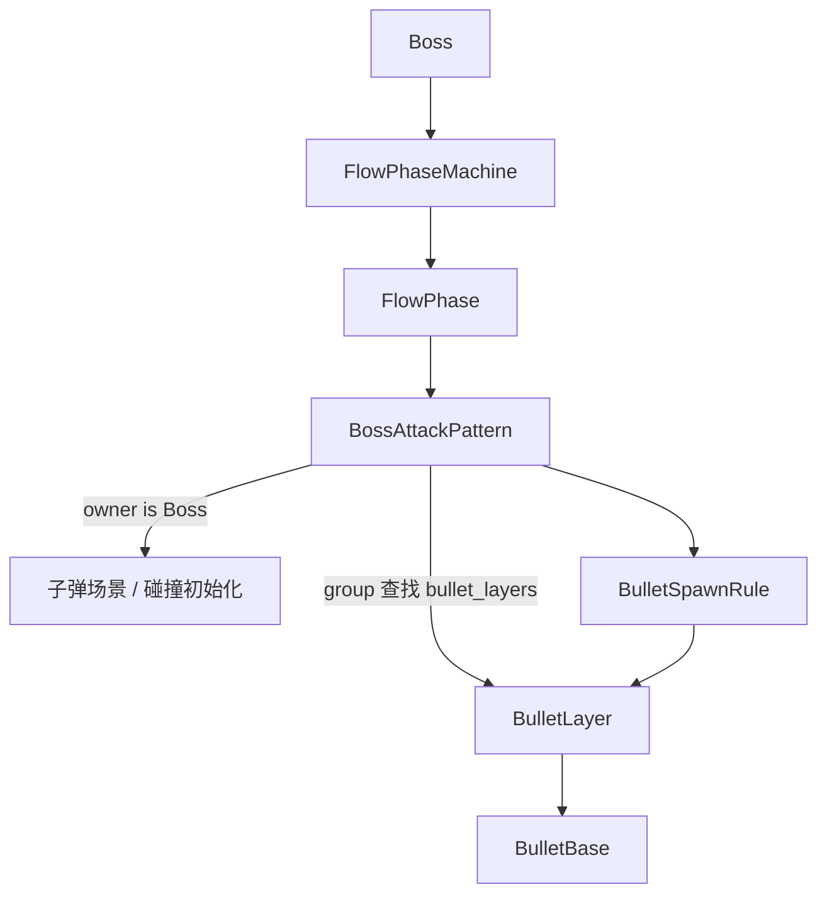

# PhaseMachine 流程体系说明

本文说明当前项目中用于 Boss 阶段、弹幕波次和流程编排的 `FlowPhaseMachine` 体系。它的目标是把“谁在执行流程”和“流程如何编排”拆开，让 Boss、子弹或后续其他发射源都可以复用同一套 Phase / Pattern 机制。

## 核心类

### FlowPhaseMachine

位置：`res://Public/flow/flow_phase_machine.gd`

职责：读取 `FlowPhase` 配置，持有底层 `StateMachine`，每帧生成 `FlowPhaseRuntimeData`，驱动当前阶段更新，并根据 transition key 切换阶段。

关键接口：

```gdscript
func setup(pattern_owner: Node) -> void
func transition_to_phase_id(phase_id: int) -> bool
func get_active_phase_id() -> int
func shutdown() -> void
```

### FlowPhase

位置：`res://Public/flow/flow_phase.gd`

职责：表示一个流程阶段，负责启动、更新、停止本阶段配置的 `FlowPattern`，并根据时间、血量比例、Pattern 完成状态决定是否转场。

关键配置：

```gdscript
@export var phase_id: int
@export var phase_name: String
@export var pattern_paths: Array[NodePath]
@export var auto_transition_after: float
@export var hp_ratio_below: float
@export var transition_keys: Array[String]
@export var transition_target_phase_ids: Array[int]
```

### FlowPattern

位置：`res://Public/flow/flow_pattern.gd`

职责：表示阶段内的一个行为单元，可以是移动、开火、等待、演出请求，也可以扩展成子弹的二次发射。它只保存 `_pattern_owner`，不再保存 Boss。

常用接口：

```gdscript
func start_pattern(pattern_owner: Node) -> void
func update_pattern(runtime_data: FlowPhaseRuntimeData) -> void
func stop_pattern() -> void
func mark_completed() -> void
func get_owner_as_boss() -> Boss
func get_owner_as_node2d() -> Node2D
```

### FlowPhaseRuntimeData

位置：`res://Public/flow/flow_phase_runtime_data.gd`

职责：保存当前帧阶段更新需要的上下文。它永远包含 `pattern_owner`、`delta`、`phase_elapsed`；当 owner 是 Boss 时，额外填充 `hp`、`max_hp`、`hp_ratio`、`player`。

## 数据流

```mermaid
flowchart TD
    Owner[Boss / Bullet / 其他 pattern_owner] -->|setup(owner)| Machine[FlowPhaseMachine]
    Machine -->|enter_state(owner)| Phase[FlowPhase]
    Phase -->|start_pattern(owner)| Pattern[FlowPattern]
    Machine -->|每帧创建| Runtime[FlowPhaseRuntimeData]
    Runtime --> Phase
    Phase -->|update_pattern(runtime)| Pattern
    Phase -->|transition key| Machine
    Machine -->|phase_changed| Owner
```

## Boss 弹幕发射流



## 使用方式

在宿主脚本中：

```gdscript
@onready var phase_machine: FlowPhaseMachine = $FlowPhaseMachine

func _ready() -> void:
    phase_machine.setup(self)
```

在场景中：

1. 给宿主节点添加 `FlowPhaseMachine` 子节点。
2. 创建 `Phases` 容器，里面放多个挂载 `FlowPhase` 的节点。
3. 在 `FlowPhaseMachine.phase_paths` 中配置阶段路径，或使用默认 `../Phases` 自动收集。
4. 在每个 `FlowPhase.pattern_paths` 中配置本阶段要运行的 Pattern。

新增 Pattern 时：

```gdscript
class_name MyPattern
extends FlowPattern

func update_pattern(runtime_data: FlowPhaseRuntimeData) -> void:
    var owner_node: Node2D = get_owner_as_node2d()
    if owner_node == null:
        return

    # 在这里编写移动、发射或演出逻辑。
```

如果 Pattern 只支持 Boss：

```gdscript
var boss: Boss = get_owner_as_boss()
if boss == null:
    return
```

这种写法比 `has_method()` 更明确，也避免了运行时反射式调用带来的拼写风险。

## BulletLayer 获取

Boss 不再保存 `BulletLayer`。`BulletLayer` 会在 `_ready()` 中加入 `bullet_layers` group。需要发射子弹的 Pattern 使用：

```gdscript
get_tree().get_first_node_in_group("bullet_layers") as BulletLayer
```

这让 Boss、子弹、炮台等不同发射源都可以共用场景里的弹幕层。

## 拓展方向

- 子弹作为 owner：子弹命中墙壁、死亡或计时结束后，可以启动自己的 Pattern 发射二次弹幕。
- 新 owner 类型：例如炮台、召唤物、关卡机关，只要在 Pattern 中添加显式类型判断即可。
- 通用攻击 Pattern：当前 `BossAttackPattern` 仍依赖 Boss 的子弹场景和碰撞初始化，后续可抽出更通用的发射上下文。
- 更丰富转场条件：现在支持时间、血量、Pattern 完成状态；后续可加入外部事件、玩家位置、清屏完成等条件。
- 多 BulletLayer 策略：当前使用 `get_first_node_in_group()`，未来如果有多个弹幕层，可以增加 group 名配置或 layer key。

## 当前不足

- `FlowPhaseRuntimeData` 仍认识 Boss，用于兼容血量转场和瞄准玩家；它不是完全纯粹的通用数据容器。
- `BossAttackPattern` 仍是 Boss 专用攻击基类，子弹二次发射建议新增专用 Pattern 或继续抽象发射上下文。
- `FlowPhaseMachine` 当前一次只运行一个阶段，不负责并行阶段、阶段栈或暂停恢复。
- `FlowPhase.pattern_paths` 仍依赖场景 NodePath 配置，重排场景节点时需要同步 Inspector 配置。
